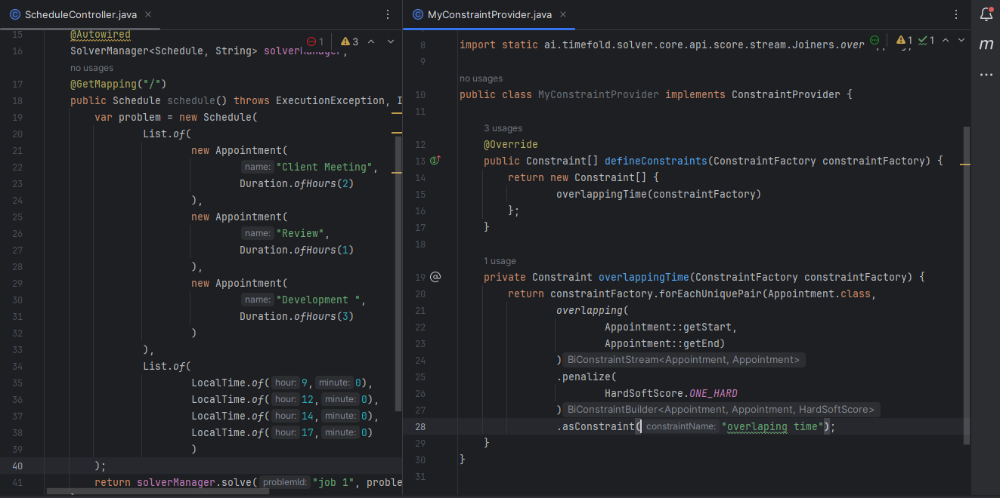

# SmartSchedulerDemo - Demo de Agendador con Timefold AI.



## Resumen

Demostración de planificación eficiente impulsada por la tecnología de optimización de Timefold.
El demo ilustra el uso de `SolverManager` para resolver problemas de planificación de manera sincronica.

## Características

- **Optimización sincronía y asincronia:**
    - `SolverManager` resuelve múltiples problemas de planificación del mismo dominio de manera asíncrona sin bloquear el hilo de llamada.

- **Fácil Implementación:**
    - Crea un `SolverManager<Solution_, ProblemId_>` utilizando `create(SolverFactory, SolverManagerConfig)`.

- **Resolución de Problemas de Planificación:**
    - Llama a `solve(Object, Object, Consumer)` o `solveAndListen(Object, Object, Consumer)` para resolver un problema de planificación.

## Información Útil sobre SolverManager

Un `SolverManager` resuelve múltiples problemas de planificación del mismo dominio de manera asíncrona sin bloquear el hilo de llamada. Para crear un `SolverManager`, utiliza `create(SolverFactory, SolverManagerConfig)`. Para resolver un problema de planificación, llama a `solve(Object, Object, Consumer)` o `solveAndListen(Object, Object, Consumer)`.

## Inicio Rápido

### Requisitos

- Kit de Desarrollo de Java (JDK) 17 o posterior
- Maven 3.6.0 o posterior

### Instalación y Ejecución del Demo

1. Clona el repositorio:
   ```bash
   git clone https://github.com/ArlandMv/SmartSchedulerDemo-Sb3-TimefoldAI
   ```

2. Navega al directorio del proyecto:
   ```bash
   cd SmartSchedulerDemo-Sb3-TimefoldAI
   ```

#### (OPCIONAL) Modifica parametros en el controlador
   ```bash
   cat src/main/java/com/mvprojects/ai/schedulingapp/schedule/ScheduleController.java
   nano src/main/java/com/mvprojects/ai/schedulingapp/schedule/ScheduleController.java
   ```
   
3. Construye el proyecto:
   ```bash
   mvn clean install
   ```

4. Ejecuta la aplicación:
   ```bash
   java -jar target/schedulingdemo-0.0.1-SNAPSHOT.jar
   ```

5. Accede a la aplicación en [http://localhost:8080](http://localhost:8080) en tu navegador web.

## Recursos

### Documentación Relevante

- [Enlace a la Documentación de SolverManager](https://timefold.ai/docs/timefold-solver/latest/quickstart/overview/overview-quickstarts)
- [Open-Source](https://github.com/timefoldai/timefold-quickstarts)
- [Soporte Opens Source y Enterprice](https://timefold.ai/support)

### Información Útil sobre SolverManager

Un `SolverManager` resuelve múltiples problemas de planificación del mismo dominio de manera asíncrona 
sin bloquear el hilo de llamada. Para obtener más detalles y ejemplos de uso, 
consulta la [documentación de SolverManager](https://timefold.ai/docs/timefold-solver/latest/using-timefold-solver/overview).

## Licencia

Este proyecto está bajo la Licencia MIT - consulta el archivo [LICENSE](LICENSE) para más detalles.

## Reconocimientos

- A Timefold por proporcionar capacidades poderosas de optimización.
